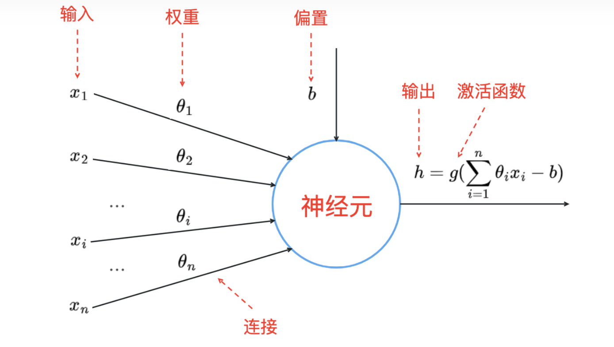

# 认识大语言模型
::: tip
hello ccc，请你认真了解并学习，remember-20250302-begin
:::

## 对llm内部工作原理的完全解释
+ 一个简单的神经网络(`a simple neural network`)<Badge type='warning' text='初步重点理解其大致的工作原理以及相应的专业名词'/>

    + 神经网络的输入与输出均为数字，即神经网络需要我们确定输入/输出的解释，最终输出的数字具体代表什么样的实际意义完全由我们赋予

    + 一些专业名词：

    

